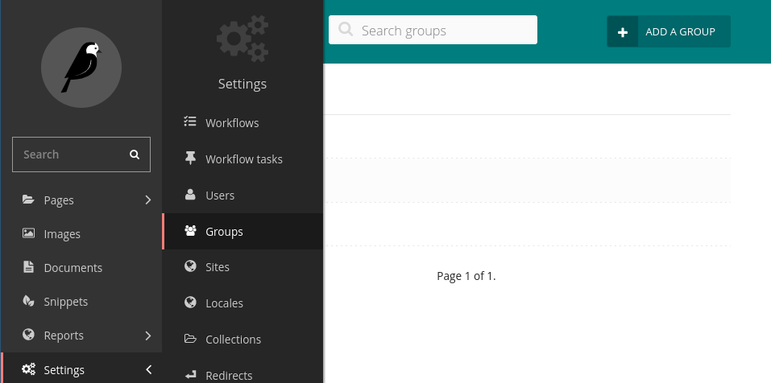

Configuring Groups
------------------

To display the wagtail-localize panel, users have to subscribe to a root
lang page and allow permissions.

The first things to do is to create a group for that.

Example with a french translation:

Create a new group
~~~~~~~~~~~~~~~~~~

In the wagtail `Settings / Groups` menu, add a new group using the 
button `Add a group`.

Then, set the name of the group.

Then, check the boxes `View the localize panel on the admin`
and `Receive email on new translations`.

Then, choose the root page of the language, and check the "edit" permissions.

Then, add save the group using the button on the bottom of the page.

To finalize your group, users must be added in the group.

Edit users under the menu `Settings / Users`

And add the new role tab of the user, check the box of the new group and
click the save button.

Now users in the group have the panel of translations in their home page:

if the checkbox `Receive email on new translations` is checked,
every time the page in the source lang is published, an email will be
sent to users to notify them of the incoming translations.

.. important::

   This plugin automatically does the "synchronize translations", so it is now useless
   to use the `Sync translated pages`
